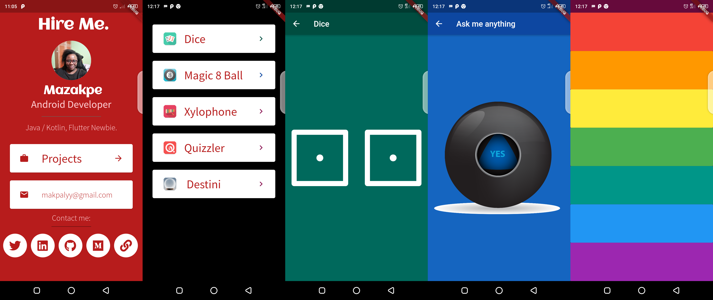

# Zero_To_Flutter (a)

A project showcasing the fundamentals of flutter ive picked up from this [Introduction to Flutter Development Using Dart course](https://www.appbrewery.co/courses/851555/lectures/15448537) by Angela Yu. 

## Built With 🛠
- [Flutter](https://kotlinlang.org/) - First class and official programming language for Android development.
- [Dart](https://kotlinlang.org/) - First class and official programming language for Android development.

## Topics covered
Upto Section 11: Boss Level Challenge 2 - Destini.
- [Course Content](https://github.com/londonappbrewery/Flutter-Course-Resources).

## Credit
This project is built along, with knowledge gained from the the course below.
- [Introduction to Flutter Development Using Dart course](https://www.udemy.com/course/flutter-bootcamp-with-dart/learn/lecture/14485452#overview0).

## Contact
If you need any help, you can connect with me.

Visit:- [maku](https://maku.dev)
